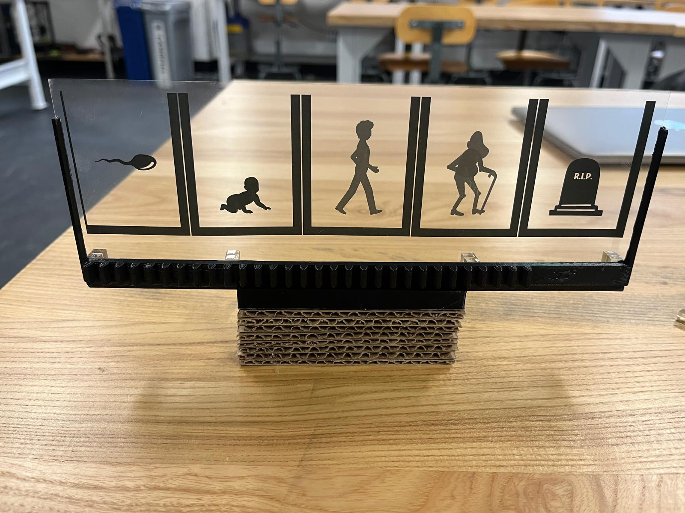
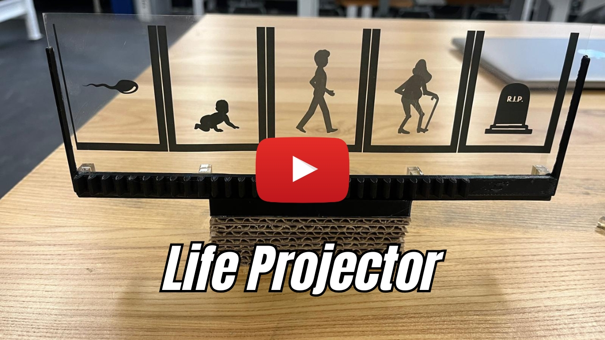
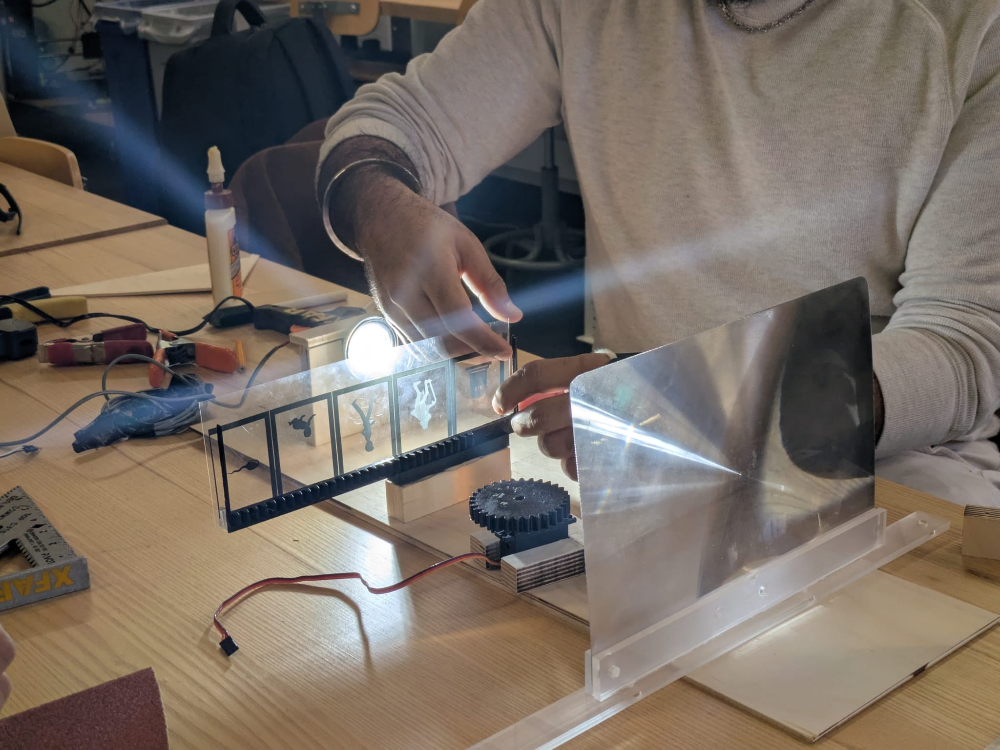
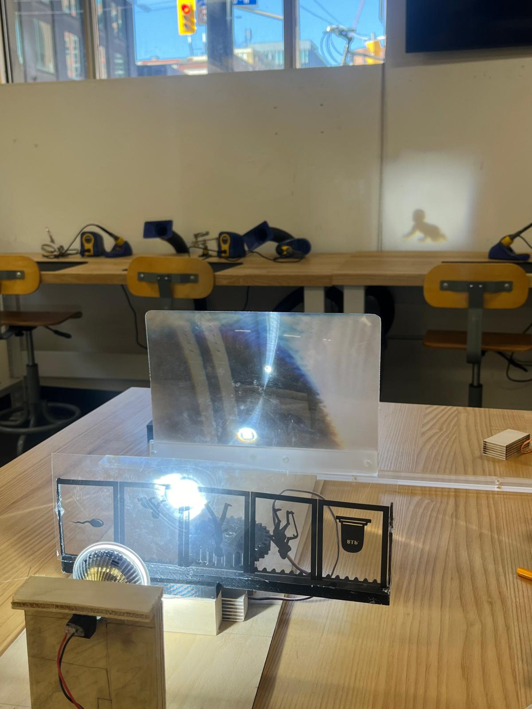
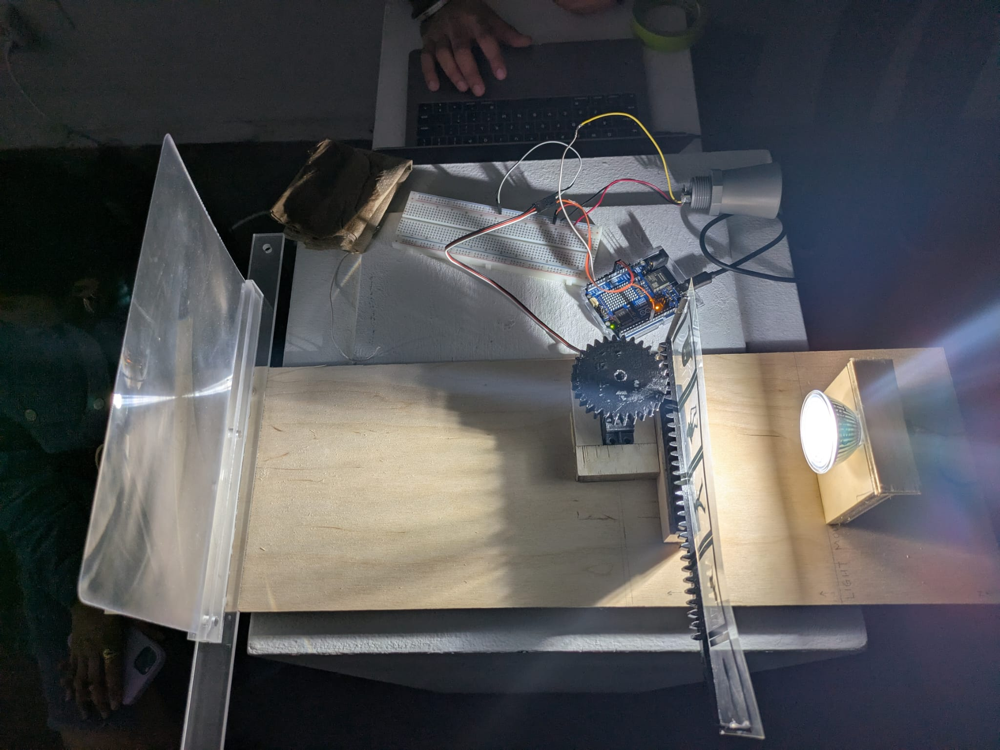
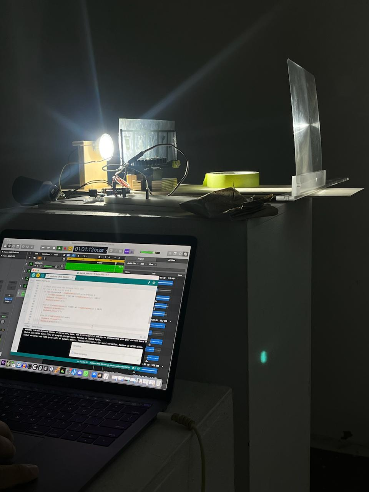

# Life Projector

We designed a **Life Projector** for the **DIGF Experiences & Interfaces** course, as part of the assignment called **IMMERSION**.

The Life Projector visually represents the five stages of human life using a shadow projection system. The five stages include:

1.  **Sperm** (Beginning of Life)
    
2.  **Baby** (Infancy)
    
3.  **Adult** (Maturity)
    
4.  **Old Age** (Aging)
    
5.  **Death** (End of Life)

    

This interactive installation uses an **Arduino Uno R4 WiFi** to track the user's distance and trigger corresponding life stage animations and soundscapes.

# How it Works

1.  **Distance-Based Interaction**: An **ultrasonic distance sensor** detects the user's position in the room.
    
2.  **Servo Motor & Gear Mechanism**: The Arduino controls a **servo motor**, which rotates a **3D-printed pinion gear**. This movement drives a **rack gear** to shift **transparent animation frames** in front of a **light bulb**.
    
3.  **Projection & Magnification**: The projected shadow is **magnified and focused** on a screen using a **Fresnel lens** to create sharp imagery.
    
4.  **Soundscapes for Each Life Stage**: A key press signal is sent to a **Mac system running Logic Pro**, triggering different soundscapes corresponding to each life stage.

P.S. Due to some technical issues, we limited the code to work with only 3 stages, but this can be easily fixed with new 3D Printed files and a few changes to the code.
    
## Hardware Components

-   **Arduino Uno R4 WiFi**
    
-   **Ultrasonic Distance Sensor**
    
-   **Servo Motor**
    
-   **3D-Printed Pinion & Rack Gear**
    
-   **Transparent Animation Sheets**
    
-   **Light Bulb & Fresnel Lens**
    
-   **Mac System with Logic Pro** (for audio immersion)

## Installation & Usage
Watch the video on YouTube🎥 👇👇

Or use this link to open the video on YT: [https://www.youtube.com/watch?v=wUKeC30f46o](https://www.youtube.com/watch?v=wUKeC30f46o)

### **1. Hardware Setup**

-   Connect the **ultrasonic sensor** to the Arduino.
    
-   Attach the **servo motor** and align it with the **rack and pinion mechanism**.
    
-   Secure the **light bulb** and **Fresnel lens** in place.
    
-   Place the **transparent animation sheets** on the moving rack.

    

### **2. Software Setup**

-   Upload the Arduino code using the **Arduino IDE**.
    
-   Connect the Arduino to the **Mac system**.
    
-   Open **Logic Pro** and assign key inputs (`d`, `f`, `g`) to trigger soundscapes.
    
-   Run the system and move through the room to see the life stages projected.

# Future Improvements

-   **Increase Frame Rate**: Add more frames for each stage for smoother transitions and make add them to a looping mechanism.
    
-   **Enhanced Projection**: Experiment with different lighting, materials and movements for improved projection experience.

## Contributors

- **Ishgun**
- **Zubin**
- **Kunal**
- **Simerneet Singh**
